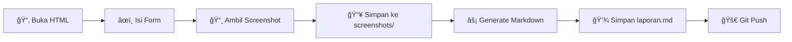

[](https://classroom.github.com/a/beoN7Yq-)
[](https://classroom.github.com/open-in-codespaces?assignment_repo_id=22407208)
<div align="center">


# 🔄 Praktikum DevOps & CI/CD Pipelines

<p align="center">
  <strong>Membangun Alur Kerja Otomatis untuk Software Delivery yang Andal</strong>
</p>


---

### 🏛️ Laboratorium Informatika
**Fakultas Teknik • Universitas Muhammadiyah Makassar**

<br/>

[](https://github.com/devnolife)
[](#)

</div>

---

## 📋 Informasi Mata Kuliah

<table>
<tr>
<td width="200"><strong>🏷️ Kode</strong></td>
<td><code>CW6552021554</code></td>
</tr>
<tr>
<td><strong>📅 Semester</strong></td>
<td>V (Lima)</td>
</tr>
<tr>
<td><strong>📊 SKS</strong></td>
<td>3 SKS</td>
</tr>
<tr>
<td><strong>🎓 Program Studi</strong></td>
<td>Informatika</td>
</tr>
<tr>
<td><strong>🏛️ Fakultas</strong></td>
<td>Teknik</td>
</tr>
<tr>
<td><strong>🏫 Universitas</strong></td>
<td>Universitas Muhammadiyah Makassar</td>
</tr>
</table>

---

## 📖 Deskripsi

<div align="center">
<table>
<tr>
<td>
<br/>

> *"Lebih dari sekadar alat, DevOps adalah budaya kolaborasi yang didukung oleh otomatisasi."*

Mata kuliah ini mengajarkan mahasiswa untuk membangun **alur kerja otomatis** untuk **Continuous Integration** dan **Continuous Delivery (CI/CD)** menggunakan teknologi industri seperti **Jenkins**, **GitLab CI**, dan **GitHub Actions**.

<br/>
</td>
</tr>
</table>
</div>

---

## 🎯 Capaian Pembelajaran

<table>
<tr>
<td>

| No | Capaian Pembelajaran |
|:--:|----------------------|
| 1️⃣ | Memahami **filosofi dan budaya DevOps** |
| 2️⃣ | Menguasai **version control** dengan Git & Git workflows |
| 3️⃣ | Mampu membangun **CI/CD pipeline** otomatis |
| 4️⃣ | Mengimplementasikan **automated testing** dalam pipeline |
| 5️⃣ | Menerapkan **deployment strategies** yang andal |

</td>
</tr>
</table>

---

## 📚 Roadmap Pembelajaran

> **8 Pertemuan** dengan pendekatan *hands-on DevOps practices* — **Disusun secara bertahap untuk pemula**

<div align="center">

```
┌─────────────────────────────────────────────────────────────────┐
│                    DEVOPS LEARNING PATH                         │
│                  (Revised Curriculum 2026)                      │
├─────────────────────────────────────────────────────────────────┤
│                                                                 │
│  FOUNDATION (Week 1-4)              CI/CD (Week 5-8)            │
│  ┌─────────────────────┐           ┌─────────────────────┐     │
│  │ 🎭 DevOps Culture   │           │ 🔧 Jenkins Setup    │     │
│  │     (Week 1)        │           │     (Week 5)        │     │
│  └─────────┬───────────┘           └─────────┬───────────┘     │
│            ▼                                  ▼                  │
│  ┌─────────────────────┐           ┌─────────────────────┐     │
│  │ 🐳 Docker           │           │ 🧪 CI + Testing     │     │
│  │    Fundamentals     │           │     (Week 6)        │     │
│  │     (Week 2)        │           └─────────┬───────────┘     │
│  └─────────┬───────────┘                     ▼                  │
│            ▼                       ┌─────────────────────┐     │
│  ┌─────────────────────┐           │ 📦 CD Pipeline      │     │
│  │ 🔀 Git Advanced     │           │     (Week 7)        │     │
│  │     (Week 3)        │           └─────────┬───────────┘     │
│  └─────────┬───────────┘                     ▼                  │
│            ▼                       ┌─────────────────────┐     │
│  ┌─────────────────────┐           │ 🏆 UTS Project      │     │
│  │ 🔍 Code Review & PR │           │     (Week 8)        │     │
│  │     (Week 4)        │           └─────────────────────┘     │
│  └─────────────────────┘                                        │
│                                                                 │
└─────────────────────────────────────────────────────────────────┘
```

</div>

### 📅 Jadwal Pertemuan (Kurikulum Revisi)

| Pertemuan | Topik | Deskripsi | Tingkat |
|:---------:|-------|-----------|:-------:|
| **01** | [🎭 DevOps Culture & Principles](./pertemuan-01/) | Filosofi DevOps, CALMS, setup environment | ⭐ |
| **02** | [🐳 Docker Fundamentals](./pertemuan-02/) | Container, images, Dockerfile, Docker Compose | ⭐⭐ |
| **03** | [🔀 Git Advanced: Branching](./pertemuan-03/) | GitFlow, GitHub Flow, merge conflicts | ⭐⭐ |
| **04** | [🔍 Code Review & Pull Request](./pertemuan-04/) | PR best practices, code review, collaboration | ⭐⭐ |
| **05** | [🔧 Introduction to CI/CD: Jenkins](./pertemuan-05/) | Jenkins setup, first pipeline, Docker integration | ⭐⭐⭐ |
| **06** | [🧪 CI Pipeline: Automated Testing](./pertemuan-06/) | Unit tests, coverage, test reports | ⭐⭐⭐ |
| **07** | [📦 CD Pipeline: Multi-Environment](./pertemuan-07/) | Staging, production, approval gates, health checks | ⭐⭐⭐⭐ |
| **08** | [🏆 **UTS: Complete CI/CD Pipeline**](./pertemuan-08/) | End-to-end project implementation | ⭐⭐⭐⭐ |

### 🎯 Perubahan dari Kurikulum Sebelumnya

| Sebelum | Sesudah | Alasan |
|---------|---------|--------|
| Git di Week 2 | Docker di Week 2 | Docker adalah fondasi penting sebelum Jenkins |
| GitLab CI di Week 7 | CD Pipeline di Week 7 | Fokus pendalaman Jenkins pipeline |
| Materi terlalu padat | Penjelasan lebih detail | Lebih mudah dipahami mahasiswa semester 5 |

---

## 🎓 Prasyarat Mahasiswa

Sebelum mengikuti praktikum ini, mahasiswa **sebaiknya** sudah:

| Skill | Level | Keterangan |
|-------|:-----:|------------|
| Git dasar | ✅ Wajib | `git add`, `commit`, `push`, `pull` |
| Command Line | ✅ Wajib | Navigasi direktori, file operations |
| Programming | ✅ Wajib | Minimal 1 bahasa (Python/JS/Go) |
| Networking dasar | 📘 Disarankan | Ports, localhost, HTTP |

---

## 🚀 Quick Start

### Prerequisites

<details>
<summary>📋 <strong>System Requirements</strong></summary>

<br/>

**Minimum Requirements:**
| Component | Requirement |
|-----------|-------------|
| 💻 CPU | 4 cores (8 recommended) |
| 💾 RAM | 8GB minimum (16GB recommended) |
| 💽 Storage | 50GB free space |
| 🖥️ OS | Windows 10/11 (WSL2), macOS, atau Linux |

**Required Software:**
- ✅ Git & Git Bash
- ✅ Docker Desktop / Docker Engine
- ✅ Visual Studio Code
- ✅ Java JDK 11+ (untuk Jenkins)

</details>

### ⚡ Installation Guide

<details>
<summary>🪟 <strong>Windows (dengan WSL2)</strong></summary>

```powershell
# Install WSL2
wsl --install

# Install Chocolatey (Package Manager)
Set-ExecutionPolicy Bypass -Scope Process -Force
[System.Net.ServicePointManager]::SecurityProtocol = [System.Net.ServicePointManager]::SecurityProtocol -bor 3072
iex ((New-Object System.Net.WebClient).DownloadString('https://community.chocolatey.org/install.ps1'))

# Install tools
choco install git docker-desktop vscode -y

# Restart terminal, then verify
git --version
docker --version
```

</details>

<details>
<summary>🍎 <strong>macOS</strong></summary>

```bash
# Install Homebrew
/bin/bash -c "$(curl -fsSL https://raw.githubusercontent.com/Homebrew/install/HEAD/install.sh)"

# Install tools
brew install git
brew install --cask docker visual-studio-code

# Verify installations
git --version
docker --version
```

</details>

<details>
<summary>🐧 <strong>Linux (Ubuntu/Debian)</strong></summary>

```bash
# Update system
sudo apt update && sudo apt upgrade -y

# Install Git
sudo apt install git -y

# Install Docker
curl -fsSL https://get.docker.com -o get-docker.sh
sudo sh get-docker.sh
sudo usermod -aG docker $USER

# Verify
git --version && docker --version
```

</details>

### 🔧 Jenkins Quick Start

```bash
# Run Jenkins dengan Docker
docker run -d \
  --name jenkins \
  -p 8080:8080 \
  -p 50000:50000 \
  -v jenkins_home:/var/jenkins_home \
  jenkins/jenkins:lts

# Get initial admin password
docker exec jenkins cat /var/jenkins_home/secrets/initialAdminPassword
```

---

## 💻 Tech Stack

<div align="center">

| Category | Technologies |
|:--------:|-------------|
| **Version Control** |    |
| **CI/CD** |    |
| **Containerization** |   |

</div>

---

## 📊 Sistem Penilaian

<div align="center">

| Komponen | Bobot |
|----------|:-----:|
| 📋 Kehadiran & Partisipasi | 10% |
| 📝 Tugas Mingguan | 30% |
| 📊 UTS (Mid-term Project) | 25% |
| 🎯 UAS (Final Project) | 35% |

</div>

### ✅ Kriteria Kelulusan

- [x] Nilai akhir minimal: **60 (D)**
- [x] Kehadiran minimal: **75%**
- [x] Mengumpulkan minimal **75%** tugas
- [x] Mengikuti **UTS dan UAS**

---

## 📁 Struktur Repository

```
📁 devops-cicd-practicum/
├── 📄 README.md
├── 📄 .gitignore
├── 📁 pertemuan-01/           # 🎭 DevOps Culture & Principles
│   ├── 📄 README.md
│   ├── 📄 laporan-template.html
│   └── 📁 screenshots/
├── 📁 pertemuan-02/           # 🐳 Docker Fundamentals
│   ├── 📄 README.md
│   ├── 📄 laporan-template.html
│   └── 📁 screenshots/
├── 📁 pertemuan-03/           # 🔀 Git Advanced: Branching
│   ├── 📄 README.md
│   ├── 📄 laporan-template.html
│   └── 📁 screenshots/
├── 📁 pertemuan-04/           # 🔍 Code Review & PR
│   ├── 📄 README.md
│   ├── 📄 laporan-template.html
│   └── 📁 screenshots/
├── 📁 pertemuan-05/           # 🔧 Jenkins Setup
│   ├── 📄 README.md
│   ├── 📄 laporan-template.html
│   └── 📁 screenshots/
├── 📁 pertemuan-06/           # 🧪 CI Pipeline: Testing
│   ├── 📄 README.md
│   ├── 📄 laporan-template.html
│   └── 📁 screenshots/
├── 📁 pertemuan-07/           # 📦 CD Pipeline: Multi-Environment
│   ├── 📄 README.md
│   ├── 📄 laporan-template.html
│   └── 📁 screenshots/
└── 📁 pertemuan-08/           # 🏆 UTS Project
    ├── 📄 README.md
    ├── 📄 laporan-template.html
    └── 📁 screenshots/
```

Setiap folder pertemuan berisi:
```
📁 pertemuan-XX/
├── 📄 README.md              # Panduan praktikum
├── 📄 laporan-template.html  # Template laporan (form)
└── 📁 screenshots/           # Folder screenshot tugas
    └── 📄 .gitkeep
```

---

## 📝 Panduan Laporan Praktikum

### Cara Menggunakan Template Laporan

1. **Buka file `laporan-template.html`** di browser (Chrome/Firefox/Edge)
2. **Isi informasi mahasiswa:**
   - NIM
   - Nama Lengkap
   - Kelas
3. **Lengkapi setiap tugas** dengan deskripsi langkah-langkah yang dilakukan
4. **Simpan screenshot** ke folder `screenshots/` dengan format penamaan:
   ```
   tugas1-nama-deskripsi.png
   tugas2-nama-deskripsi.png
   ```
5. **Klik tombol "Generate Laporan"** untuk menghasilkan markdown
6. **Copy** hasil markdown dan **simpan** sebagai `laporan.md` di folder pertemuan

### Struktur Folder Screenshot

```
📁 pertemuan-XX/screenshots/
├── 📄 tugas1-docker-build.png
├── 📄 tugas1-docker-run.png
├── 📄 tugas2-jenkins-pipeline.png
└── 📄 tugas3-test-result.png
```

### Format Penamaan Screenshot

| Format | Contoh |
|--------|--------|
| `tugasX-deskripsi.png` | `tugas1-dockerfile.png` |
| `tugasX-step-deskripsi.png` | `tugas2-step1-build.png` |
| `hasil-deskripsi.png` | `hasil-jenkins-success.png` |

### Workflow Pengumpulan Laporan



### Checklist Sebelum Submit

- [ ] Semua field di form terisi lengkap
- [ ] Screenshot tersimpan di folder `screenshots/`
- [ ] File `laporan.md` sudah di-generate dan disimpan
- [ ] Semua file sudah di-commit dan push ke repository

---

## 📚 Resources

<div align="center">

| Resource | Link |
|----------|------|
| 📖 Jenkins Documentation | [jenkins.io/doc](https://www.jenkins.io/doc/) |
| 🦊 GitLab CI/CD Docs | [docs.gitlab.com](https://docs.gitlab.com/ee/ci/) |
| 🐙 GitHub Actions Docs | [docs.github.com](https://docs.github.com/en/actions) |
| 🐳 Docker Documentation | [docs.docker.com](https://docs.docker.com/) |

</div>

---

## 📞 Kontak

<div align="center">

| Platform | Link |
|----------|------|
| 🏛️ Laboratorium Informatika | Fakultas Teknik - Unismuh Makassar |
| 🐙 GitHub | [@devnolife](https://github.com/devnolife) |

---

<br/>

**Made with ❤️ by Laboratorium Informatika - Fakultas Teknik**

**Universitas Muhammadiyah Makassar**

<br/>

[](https://github.com/devnolife)

</div>
