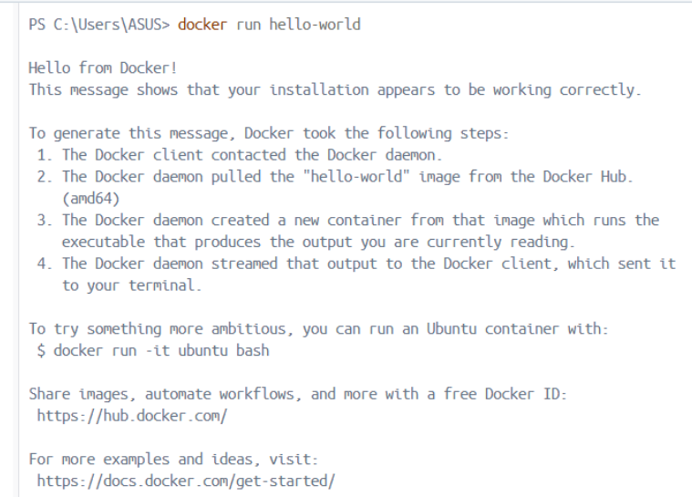

# 📋 Laporan Praktikum Pertemuan 01
## DevOps Culture & Principles

---

## 👤 Identitas Mahasiswa

| Item | Keterangan |
|------|------------|
| **Nama** | Nurul Mustainna |
| **NIM** | 105841104423 |
| **Kelas** | 5B |
| **Tanggal** | 2026-02-25 |

---

## 📚 Pemahaman DevOps

### Apa itu DevOps?

DevOps adalah pendekatan dan budaya kerja yang mengintegrasikan tim Development dan Operations untuk menghilangkan sekat (silo) yang sebelumnya sering menimbulkan konflik akibat perbedaan prioritas antara kecepatan pengembangan dan stabilitas sistem. Dengan menekankan kolaborasi, komunikasi, dan otomatisasi proses seperti pengujian serta deployment, DevOps bertujuan memperpendek siklus pengembangan dan memungkinkan pengiriman fitur, perbaikan, serta pembaruan secara berkelanjutan dengan kualitas tinggi. Lebih dari sekadar penggunaan tools, DevOps merupakan perubahan mindset dalam membangun, menguji, dan mendistribusikan produk IT agar lebih cepat, stabil, dan aman.

Secara konseptual, DevOps lahir sebagai respons terhadap keterbatasan pendekatan tradisional seperti model Waterfall yang cenderung kaku dan memisahkan tanggung jawab antar tim. Dalam praktik modern, DevOps sangat erat kaitannya dengan pendekatan Agile, misalnya dalam kerangka kerja seperti Scrum yang menekankan iterasi singkat dan feedback cepat. DevOps melengkapi praktik Agile dengan memastikan bahwa setiap perubahan kode tidak hanya selesai di tahap pengembangan, tetapi juga dapat diintegrasikan, diuji, dan dirilis secara otomatis ke lingkungan produksi melalui praktik Continuous Integration dan Continuous Deployment (CI/CD).

Implementasi DevOps biasanya melibatkan penggunaan berbagai tools seperti Docker untuk containerization, Jenkins untuk automasi pipeline CI/CD, dan Kubernetes untuk orkestrasi container. Namun, esensi DevOps tidak terletak pada alat tersebut, melainkan pada budaya kerja yang menekankan tanggung jawab bersama (shared responsibility), monitoring berkelanjutan, serta perbaikan terus-menerus (continuous improvement). Dengan pendekatan ini, organisasi dapat meningkatkan frekuensi rilis, mengurangi tingkat kegagalan perubahan, mempercepat waktu pemulihan ketika terjadi gangguan (mean time to recovery), serta meningkatkan kepuasan pengguna karena pembaruan sistem dapat dilakukan secara lebih cepat dan andal.

Selain itu, DevOps juga mendorong penerapan Infrastructure as Code (IaC), di mana konfigurasi infrastruktur dikelola melalui kode sehingga lebih konsisten, terdokumentasi, dan mudah direplikasi. Praktik ini membantu meminimalkan kesalahan manual serta meningkatkan skalabilitas sistem. Dengan demikian, DevOps bukan hanya strategi teknis, tetapi transformasi menyeluruh dalam cara organisasi merancang, mengembangkan, mengoperasikan, dan memelihara sistem teknologi informasi secara adaptif dan berorientasi pada nilai bisnis.

### Mengapa DevOps Penting?

DevOps menjadi penting di era digital karena perusahaan dituntut untuk menghadirkan inovasi secara cepat tanpa mengorbankan kestabilan sistem. Tanpa penerapan DevOps, proses rilis aplikasi cenderung lebih lambat, kompleks, dan berisiko tinggi terhadap kesalahan manual. Sebagai ilustrasi, ketika sebuah platform e-commerce mengalami lonjakan pengunjung saat momen promo besar seperti Harbolnas, gangguan kecil pada fitur pembayaran dapat berdampak signifikan. Dengan penerapan praktik Continuous Integration dan Continuous Delivery (CI/CD), tim pengembang dapat segera memperbaiki kesalahan, menjalankan pengujian otomatis, dan merilis pembaruan ke lingkungan produksi dalam waktu singkat, sehingga layanan tetap berjalan lancar tanpa mengganggu pengalaman pengguna.

### Contoh Perusahaan yang Menerapkan DevOps

Netflix, Amazon, Google, dan Facebook.

---

## 🎯 Pemahaman Prinsip CALMS

C - Culture (Budaya): Membangun rasa tanggung jawab bersama antara Dev dan Ops. Contoh: Melakukan blameless post-mortem (evaluasi tanpa saling menyalahkan) ketika terjadi server down untuk fokus mencari solusi sistematis.

A - Automation (Otomatisasi): Mengurangi pekerjaan manual yang berulang. Contoh: Menggunakan alat seperti GitHub Actions atau Jenkins untuk otomatis menjalankan testing setiap kali ada programmer yang melakukan commit kode baru.

L - Lean (Ramping): Menghilangkan proses yang tidak memberikan nilai tambah (waste). Contoh: Mengurangi lapisan birokrasi approval berlapis untuk rilis fitur kecil yang sudah lulus automated testing.

M - Measurement (Pengukuran): Memantau semua aspek performa sistem. Contoh: Menggunakan Prometheus atau Grafana untuk memonitor metrik penggunaan CPU, RAM, dan tingkat error pada aplikasi secara real-time.

S - Sharing (Berbagi): Berbagi pengetahuan, tools, dan ide. Contoh: Membuat dokumentasi Wiki/Confluence yang terpusat sehingga teknisi baru bisa langsung memahami arsitektur sistem tanpa harus bertanya berulang-ulang.

---

## 🔧 Setup Development Environment

### Versi Software

| Software | Versi |
|----------|-------|
| Git | git version 2.53.0 |
| Docker | Docker version 29.0.1 |

### Konfigurasi Git

```
user.name = NurulMustainna
user.email = 1058411004423@student.unismuh.ac.id
```

### VS Code Extensions

1.Docker
2.GitLens
3.YAML
4.Live Preview

### GitHub Account

- Username: NurulMustainna

---

## 📸 Screenshots

| No | Screenshot | Keterangan |
|----|------------|------------|
| 1 |  | Output git --version |
| 2 |  | Output git config --list |
| 3 |  | Output docker --version |
| 4 |  | Output docker run hello-world |
| 5 |  | VS Code dengan extensions |

--
## 💭 Refleksi Pribadi

### Harapan dari Praktikum Ini

Harapan saya adalah mendapatkan pemahaman praktis mengenai bagaimana siklus pengembangan perangkat lunak di industri modern berjalan, serta terbiasa menggunakan tools standar industri.

### Skill yang Ingin Dikuasai

Saya ingin menguasai otomatisasi CI/CD pipelines, mahir menggunakan Git untuk kolaborasi tingkat lanjut (branching strategies), serta memahami dasar-dasar containerization menggunakan Docker.

### Tantangan yang Dihadapi

Tantangan terbesarnya adalah memahami dan membedakan alur kerja sistem version control (seperti fork, syncing commit), serta memastikan seluruh environment lokal seperti Docker berjalan tanpa error di tahap awal setup.

---

## ✅ Checklist

- [x] Git terinstall dan terkonfigurasi dengan benar
- [x] Docker dapat menjalankan container hello-world
- [x] VS Code terinstall dengan semua extensions yang diminta
- [x] Laporan ditulis dengan bahasa yang baik dan benar
- [x] Semua screenshot jelas dan terbaca

---

*Laporan ini dibuat pada Rabu, 25 Februari 2026*